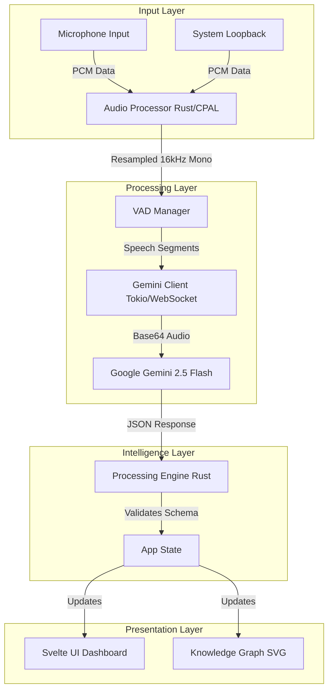

# Cognivox - Passive Meeting Intelligence Engine

<div align="center">


**A Real-Time LLM-Powered Meeting Intelligence Engine with Knowledge Graph Visualization**

*Real-time meeting intelligence powered by Google Gemini AI*

[Features](#features) • [Installation](#installation) • [Usage](#usage) • [Architecture](#architecture) • [Challenges](#challenges)

</div>

---

## Developers

<table>
<tr>
<td align="center">
<br />
<sub><b>Shehr Bano</b></sub><br />
<sub>Lead Developer</sub><br />
<sub>Backend Architecture & AI Integration</sub><br />
<sub>Computer Science Department, Namal University, Mianwali</sub>
</td>
<td align="center">
<br />
<sub><b>Anila Younas</b></sub><br />
<sub>Lead Developer</sub><br />
<sub>Frontend Design & UX Engineering</sub><br />
<sub>Computer Science Department, Namal University, Mianwali</sub>
</td>
</tr>
</table>

---

## Overview

**Cognivox** is a cutting-edge **passive meeting intelligence engine** that captures system-wide audio, processes it through Google's Gemini AI, and provides real-time meeting intelligence with zero-latency optimizations. Constructed on a high-performance **Rust** backend with a **Tauri** frontend, it transforms the transient nature of verbal communication into structured knowledge.

### The Problem: Ephemeral Intelligence
Meeting intelligence traditionally focuses on post-hoc transcription—processing recordings *after* a meeting. Although useful for archiving, this lacks the immediacy necessary for agile decision-making. Verbal meetings create streams of continuous, unstructured audio, and without active note-taking, key decisions, tasks, and risks are often lost to the ether.

### The Solution: Cognivox
Cognivox overcomes these limitations by moving from simple transcription to **semantic understanding**. The system operates as an enhanced "second mind," automatically converting unstructured speech into actionable JSON entities—Tasks, Decisions, Risks, and Knowledge Graph nodes—in real time.

Designed to be an **invisible, silent corporate meeting intelligence engine**, it processes:
- Urdu/English code-switching
- Dense overlaps and interruptions
- Noisy rooms with background chatter
- Micro-tone emotion detection
- Urgency, hesitation, and dominance analysis

---

## Features

### Station 1: Omnipresent Audio Capture
*The foundation of the system is a high-fidelity, thread-safe audio pipeline implemented in Rust.*
- **Dual-Stream Capture**: Simultaneously records microphone input and system output via WASAPI loopback, enabling capture of both local and remote participants.
- **High-Quality Processing**: Uses Rubato Sinc interpolation for pristine resampling to 16kHz, ensuring optimal speech recognition accuracy.
- **Intelligent Mixing**: Performs channel averaging to produce a clean mono output suitable for LLM processing.
- **Zero-Latency Buffers**: Implements lock-free Crossbeam channels for efficient, non-blocking data transfer between the audio thread and the processing engine.
- **VAD Integration**: Custom hybrid Voice Activity Detection (RMS + Temporal Logic) filters silence to reduce latency and API costs.

### Station 2: Gemini Live API Integration
*A robust, fault-tolerant bridge to the Google Gemini 2.5 Flash model.*
- **WebSocket Client**: Manages real-time bidirectional communication with Gemini, handling connection state and error recovery.
- **Smart Audio Streaming**: Converts F32 PCM audio to I16, then Base64 encodes it for transmission in strict JSON payloads.
- **Schema Validation**: Enforces a rigid JSON output schema to prevent hallucinations and ensure data consistency.
- **Text Modality**: Operates in "passive mode" where the AI observes and reports, rather than actively participating in the conversation.

### Station 3: Hypersonic Processing Engine
*The central nervous system that validates, structures, and dispatches intelligence.*
- **JSON Schema Validation**: Validates 16 distinct intelligence categories and 9 emotional tones against strict allow-lists.
- **Optimistic Updates**: Displays low-confidence partial transcripts immediately for instant feedback, then updates them as confidence increases.
- **Graph State Management**: Maintains a thread-safe in-memory graph of all entities (Nodes) and their relationships (Edges).
- **Entity Extraction**: Identifies Named Entities (People, Projects, Deadlines) and maps their relationships.

### Station 4: Psychic Desktop Dashboard
*A high-performance, reactive visualization interface built with Svelte 5.*
- **Haptic-Dark Theme**: A Matrix-inspired aesthetic designed for long-term usage with minimal eye strain.
- **Live Transcript View**: Renders streaming intelligence cards with micro-animations and status indicators.
- **Knowledge Graph Visualization**: Custom SVG-based force-directed graph rendering engine (physics implemented in JS) that spatializes meeting concepts.
- **Cognivox Controls Panel**: Granular control over confidence thresholds, VAD sensitivity, and categorization filters.
- **Diagnostics Panel**: Real-time monitoring of Audio Latency (<50ms), Gemini API Latency (<200ms), and UI Frame Rate.

### Station 5: Post-Processing & Omnicontrol
*Tools for persistence, review, and export.*
- **Session Management**: Full CRUD operations for meeting sessions, persisted to local storage.
- **Multi-Format Export**:
  - **JSON**: Complete session dump with all metadata and raw data.
  - **CSV**: Tabular transcript data for analysis in Excel/Google Sheets.
  - **Markdown**: Formatted meeting minutes ready for documentation.
- **Local Persistence**: Automatic management of the application data directory (`AppData/Local/...`).

---

## Architecture

### System Architecture Diagram



### Technology Stack & Justification

#### Backend: Rust
Rust was chosen for its memory safety without garbage collection. In real-time audio processing, GC pauses cause buffer under-runs and audio glitches. Rust's ownership model ensures deterministic performance, while the `cpal` crate provides native access to Windows WASAPI for low-level audio control.

#### Frontend: Svelte 5
Svelte's compile-time reactivity model eliminates the Virtual DOM, making it significantly faster for high-frequency updates like the real-time Knowledge Graph visualization. This ensures a consistent 60 FPS even when rendering complex, moving graph nodes.

#### Desktop Framework: Tauri v2
Tauri uses the system's native WebView (WebView2 on Windows) rather than bundling Chromium. This reduces the application binary size to <10MB and minimizes memory footprint, allowing Cognivox to run invisibly alongside heavy conferencing tools like Zoom or Teams.

#### AI Model: Google Gemini 2.5 Flash
Chosen for its extreme low latency and high throughput. Its multimodal capabilities allow direct processing of audio inputs, and its strong reasoning capabilities enable semantic diarization (identifying speakers by context) without needing heavy local acoustic models.

---

## Challenges Faced

### 1. WASAPI Loopback Integration
**Challenge**: Capturing system audio (what the user hears) alongside microphone input is non-trivial. Windows WASAPI Loopback operates on a different clock and often different sample rates than microphone input.
**Resolution**: Implemented a `CaptureMode::SystemOnly` route in the Rust backend using `cpal`'s host-specific WASAPI features. Created a custom mixing pipeline to resample both streams to a common 16kHz clock domain before mixing.

### 2. Non-Deterministic JSON Outputs
**Challenge**: LLMs, being probabilistic, occasionally produce malformed JSON (trailing commas, missing fields), which typically crashes strict parsers.
**Resolution**: Implemented a "soft-fail" validation layer in `processing_engine.rs`. The system attempts to parse; if it fails, it increments an internal `error_streak` counter and seamlessly discards the bad chunk, ensuring the UI never crashes due to AI hallucination.

### 3. Graph Physics Stability
**Challenge**: The custom force-directed graph initially suffered from "node jitter"—nodes vibrating endlessly due to conflicting forces.
**Resolution**: Tuned the physics simulation constants (repulsion, attraction, damping) specifically for the scale of meeting data. Implemented a "cooling" factor that gradually freezes nodes once they reach a stable equilibrium.

---

## Installation

### Prerequisites

- **Rust**: Version 1.70 or higher
- **Node.js**: Version 18 or higher
- **Windows**: Required for WASAPI loopback support (Windows 10 or later recommended)

### Step-by-Step Installation

1. **Clone the Repository**
   ```bash
   git clone https://github.com/namal-university/cognivox.git
   cd cognivox
   ```

2. **Install Node.js Dependencies**
   ```bash
   npm install
   ```

3. **Verify Rust Dependencies**
   ```bash
   cd src-tauri
   cargo check
   cd ..
   ```

4. **Run in Development Mode**
   ```bash
   npm run tauri dev
   ```

---

## Usage Guide

### First-Time Setup
1. **Launch**: Run `npm run tauri dev`.
2. **Connect**: Enter your Google Gemini API Key in the sidebar.
3. **Capture**: Select audio devices and click "Start Capture".

### Core Workflows
- **Live Transcripts**: View real-time cards with Speaker ID, Tone, and Category.
- **Knowledge Graph**: Interact with the dynamic node map of the meeting context.
- **Controls**: Adjust confidence thresholds and VAD sensitivity on the fly.
- **Export**: Save sessions as JSON, CSV, or Markdown.

---

## Cognivox Schema

### Intelligence Output Structure
```json
{
  "timestamp_ms": 1234567890,
  "speaker_id": "Speaker_1",
  "transcript_chunk": "Let's discuss the project timeline.",
  "is_final": true,
  "intelligence": {
    "category": ["TASK", "DECISION"],
    "summary": "Discussion about project timeline",
    "tone": "NEUTRAL",
    "confidence": 0.95,
    "entities": [
      {
        "text": "project timeline",
        "type": "TASK",
        "start_ms": 1234567890,
        "end_ms": 1234567900,
        "confidence": 0.92
      }
    ],
    "graph_updates": [
      {
        "node_a": "Project",
        "relation": "HAS_DEADLINE",
        "node_b": "Timeline",
        "weight": 0.9,
        "directional": true,
        "tone_modifier": 0.0
      }
    ]
  }
}
```

### Intelligence Categories
- **TASK**, **DECISION**, **DEADLINE**, **QUERY**, **ACTION_ITEM**, **RISK**
- **SENTIMENT**, **URGENCY**, **INTERRUPTION**, **AGREEMENT**, **DISAGREEMENT**
- **OFF_TOPIC**, **EMOTION_SHIFT**, **DOMINANCE_SHIFT**, **EMPATHY_GAP**, **TOPIC_DRIFT**

---

## License

MIT License

Copyright (c) 2025 Shehr Bano & Anila Younas
